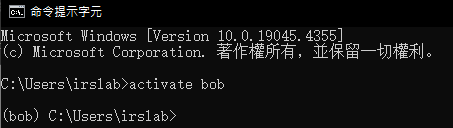
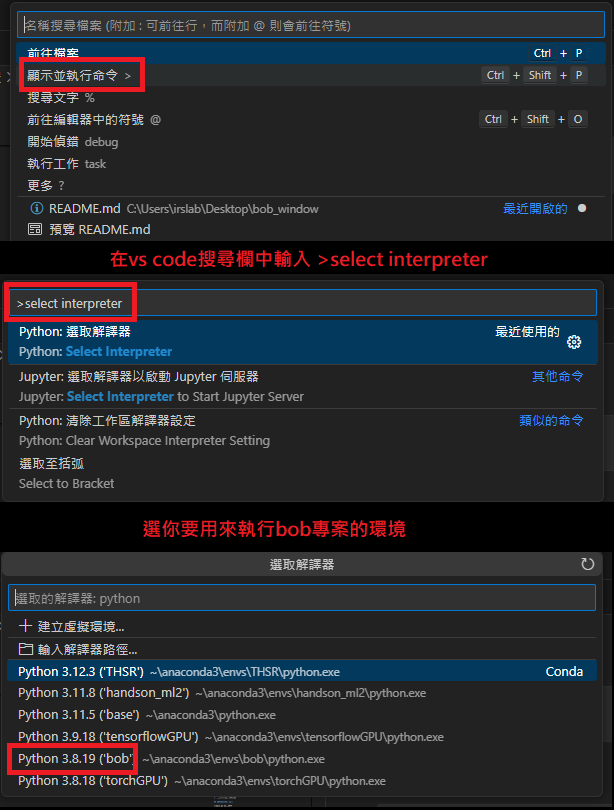

# Bob-Python

## 下載程式

1. 開啟Github網站
2. Fork實驗室Bob-Python專案


3. Fork之後帳號會出現一份自己的repo，右邊即為到時候git clone的時候需要用到的網址。


4. 點選右邊下拉欄位的 [Settings -> Developer settings](https://github.com/settings/apps)

5. 選擇Personal access tokens (classic)
6. Generate New token，照下圖選擇過期日和權限


7. token即為你存取github repo的密碼，只會顯示一次，妥善保管token。


8. 把repo複製下來到本機，並更新子模組

```shell
# pull Bob-python
git clone https://[你的Token]@github.com/[你的帳號名稱]/Bob-python.git -b develop
cd Bob-python
#更新submodule
git submodule init
git submodule update --remote
```


## 已測試版本

- python 3.8.X on windows 10/11

## 環境建置

### 1. 安裝python虛擬環境

- 安裝CUDA 11.8版本(可選，for GPU加速)
  - [網站連結](https://developer.nvidia.com/cuda-toolkit-archive)

  - [下載連結](https://developer.download.nvidia.com/compute/cuda/11.8.0/local_installers/cuda_11.8.0_522.06_windows.exe)
  用自訂(進階選項)安裝，只勾選CUDA

- 安裝anaconda

- 新增anaconda到環境變數後重新開機

[參考文章](https://ithelp.ithome.com.tw/articles/10291890)

### 2. 建置並進入虛擬環境

建立虛擬環境
- 在cmd中輸入
```
conda create --name <youenv> python=3.8
```
開啟虛擬環境
```
activate <youenv>
```
完成後如圖



### 3. 安裝套件

安裝pytorch套件(可選，for GPU加速)
- 在虛擬環境中輸入安裝指令
```shell
pip3 install torch torchvision torchaudio --index-url https://download.pytorch.org/whl/cu118
```
安裝所有套件
```shell
pip install -r requirements.txt
```

根目錄下的requirements.txt為yolov5的套件，

安裝完成後，直接執行主程式，看缺少甚麼套件再自行pip install該套件


### 4. 設定VS Code interpreter



## 三種平板連線方式

1. 使用HC-05藍芽模組搭配UART轉USB
2. 使用電腦內建藍芽
3. 使用網路進行TCP傳輸

## 如何切換連線方式

在main.py 進行更改

```python
class MainProgram:
    ...
    def initialize_device(self) -> ReConnectableDevice:
        # 使用TCP傳輸
        # return TCPServerDevice("0.0.0.0", 4444, EOLPackageHandler())

        # 使用藍芽傳輸
        return BluetoothServerDevice(EOLPackageHandler())

        # 使用HC-05
        # return SerialServerDevice(getSerialNameByDescription(bt_description), 38400, EOLPackageHandler())
```