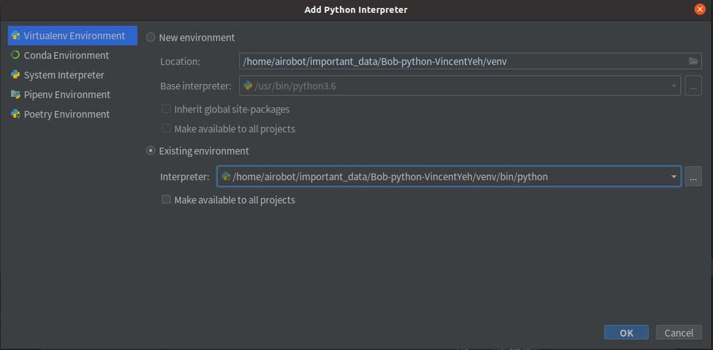

# Bob-Python

## 下載程式

```shell
# pull Bob-python
git clone https://[github Token]@github.com/VincentYeh-dev/Bob-python.git -b develop
cd Bob-python
#更新submodule
git submodule init
git submodule update --remote
```


## 已測試版本

- Python 3.6.9 ERROR
- Python 3.8.10 OK
- Python 3.8.16 OK

### 環境建置

1. 安裝python和虛擬環境

```
sudo add-apt-repository ppa:deadsnakes/ppa
sudo apt-get update
sudo apt-get install python3.8 python3.8-dev
python3.8 -m pip install virtualenv
```
2. 建置並進入虛擬環境

```shell
python3.8 -m virtualenv venv
source venv/bin/activate
pip install -U pip setuptools==57.5.0
```

3. 安裝依賴

在資料夾下，會看到requirements_xx_x.x.xx.txt，依環境安裝相對應的依賴

| 檔名                        | Python版本 | 平台                | 連線方式                   |
| --------------------------- | ---------- | ------------------- | -------------------------- |
| requirements_pc_3.8.16.txt  | 3.8.16     | 有內建藍芽電腦      | HC-05 / 網路TCP / 內建藍芽 |
| requirements_agx_3.8.10.txt | 3.8.10     | *Jetson AGX* Xavier | HC-05 / 網路TCP            |
| requirements_pc_3.8.10.txt  | 3.8.10     | 有內建藍芽電腦      | HC-05 / 網路TCP / 內建藍芽 |

```shell
pip install -r requirements_xx_x.x.xx.txt
```
4. Setting pycharm python interpreter


## 三種平板連線方式

1. 使用HC-05藍芽模組搭配UART轉USB
2. 使用電腦內建藍芽
3. 使用網路進行TCP傳輸

### 如何切換連線方式

在main.py 進行更改

```python
class MainProgram:
    ...
    def initialize_device(self) -> ReConnectableDevice:
        # 使用TCP傳輸
        # return TCPServerDevice("0.0.0.0", 4444, EOLPackageHandler())

        # 使用藍芽傳輸
        return BluetoothServerDevice(EOLPackageHandler())

        # 使用HC-05
        # return SerialServerDevice(getSerialNameByDescription(bt_description), 38400, EOLPackageHandler())
```


在communication/concrete/crt_comm.py，可更改是否要匯入相關連線函式庫，使用*Jetson AGX* Xavier必須將bluetooth_import設為**False**

```python
bluetooth_import = True
tcp_import = True
serial_import = True
```

### PyBluez (Jetson 不能用)

#### 安裝

開啟終端機輸入

```shell
sudo apt install python3.8-dev libbluetooth-dev
```

打開藍牙服務配置文件

```shell
sudo nano /etc/systemd/system/dbus-org.bluez.service
```

尋找以“ExecStart”開頭的行，並在行尾添加兼容性標誌“-C”

```
ExecStart=/usr/lib/bluetooth/bluetoothd -C
```

 在“ExecStart”行之後立即添加一行，然後保存並關閉文件

```
ExecStartPost=/usr/bin/sdptool add SP
```

重新加載配置文件

```
sudo systemctl daemon-reload
```

重新啟動服務

```
sudo systemctl restart bluetooth.service
```


### 在Jetson AGX 安裝 tensorflow

[在Jetson 安裝tensorflow](https://docs.nvidia.com/deeplearning/frameworks/install-tf-jetson-platform/index.html)

```shell=
$ sudo apt-get update
$ sudo apt-get install libhdf5-serial-dev hdf5-tools libhdf5-dev zlib1g-dev zip libjpeg8-dev liblapack-dev libblas-dev gfortran

$ sudo apt-get install python3-pip
$ sudo pip3 install -U pip testresources setuptools==49.6.0 

$ sudo pip3 install -U --no-deps numpy==1.19.4 future==0.18.2 mock==3.0.5 keras_preprocessing==1.1.2 keras_applications==1.0.8 gast==0.4.0 protobuf pybind11 cython pkgconfig packaging
$ sudo env H5PY_SETUP_REQUIRES=0 pip3 install -U h5py==3.1.0

$ sudo pip3 install --pre --extra-index-url https://developer.download.nvidia.com/compute/redist/jp/v50 tensorflow

```

查看tensorflow版本
```shell=
pip3 list |grep "tensor"
tensorboard             2.8.0
tensorboard-data-server 0.6.1
tensorboard-plugin-wit  1.8.1
tensorflow              2.8.0+nv22.5
tensorflow-estimator    2.8.0
```

JP_VERSION=5.0.1 DP
TF_VERSION=2.8.0
NV_VERSION=22.5

將``$NV_VERSION``、``$TF_VERSION``換成上方版本號

進入虛擬環境後

```shell=
$ pip3 install -U numpy grpcio absl-py py-cpuinfo psutil portpicker six mock requests gast h5py astor termcolor protobuf keras-applications keras-preprocessing wrapt google-pasta setuptools testresources
$ pip3 install --extra-index-url https://developer.download.nvidia.com/compute/redist/jp/v50 tensorflow==$TF_VERSION+nv$NV_VERSION
```


## 可能遇到問題

### 無法在Pycharm執行Dynamixel SDK

開啟選項**Emulate terminal in output console**

```shell
Traceback (most recent call last):
  File "/mnt/EAFC7A87FC7A4E37/git_projects/Linux/Bob/Bob_python/bb.py", line 1, in <module>
    from Bob.robot.concrete.crt_dynamixel import DynamixelRobot
  File "/mnt/EAFC7A87FC7A4E37/git_projects/Linux/Bob/Bob_python/Bob/robot/concrete/crt_dynamixel.py", line 16, in <module>
    old_settings = termios.tcgetattr(fd)
termios.error: (25, 'Inappropriate ioctl for device')
```

### 手機無法連線Serial Port Server

終端機輸入

```shell
sudo hciconfig hci0 piscan
```

### 藍芽sp無裝置

```
Traceback (most recent call last):
  File "/mnt/EAFC7A87FC7A4E37/git_projects/Linux/Bob/Bob_python/bt_main.py", line 19, in <module>
    server = BluetoothServer(ConnectListener())
  File "/mnt/EAFC7A87FC7A4E37/git_projects/Linux/Bob/Bob_python/Bob/bluetooth_utils/utils.py", line 28, in __init__
    profiles=[bluetooth.SERIAL_PORT_PROFILE],
  File "/home/vincent/PyEnv/bob/lib/python3.6/site-packages/bluetooth/bluez.py", line 275, in advertise_service
    raise BluetoothError (*e.args)
bluetooth.btcommon.BluetoothError: no advertisable device
```

終端機輸入

```shell
sudo sdptool add SP
```

### 藍芽sp權限遭拒

```
During handling of the above exception, another exception occurred:

Traceback (most recent call last):
  File "/home/vincent/git_projects/Bob/Bob_python/bt_main.py", line 19, in <module>
    server = BluetoothServer(ConnectListener())
  File "/home/vincent/git_projects/Bob/Bob_python/Bob/bluetooth_utils/utils.py", line 28, in __init__
    profiles=[bluetooth.SERIAL_PORT_PROFILE],
  File "/home/vincent/git_projects/Bob/Bob_python/venv/lib/python3.6/site-packages/bluetooth/bluez.py", line 275, in advertise_service
    raise BluetoothError (*e.args)
bluetooth.btcommon.BluetoothError: [Errno 13] Permission denied
```

終端機輸入

```shell
sudo chmod 666 /var/run/sdp
```

### cannot allocate memory in static TLS block 

```
Traceback (most recent call last):
  File "/home/airobot/important_data/Bob/Bob_python/detector_test.py", line 6, in <module>
    from Bob.visual.detector.concrete.object_detect_yolov5 import ObjectDetector
  File "/home/airobot/important_data/Bob/Bob_python/Bob/visual/detector/concrete/object_detect_yolov5.py", line 5, in <module>
    import torch
  File "/home/airobot/important_data/Bob/Bob_python/venv3.8/lib/python3.8/site-packages/torch/__init__.py", line 198, in <module>
    _load_global_deps()
  File "/home/airobot/important_data/Bob/Bob_python/venv3.8/lib/python3.8/site-packages/torch/__init__.py", line 151, in _load_global_deps
    ctypes.CDLL(lib_path, mode=ctypes.RTLD_GLOBAL)
  File "/usr/lib/python3.8/ctypes/__init__.py", line 373, in __init__
    self._handle = _dlopen(self._name, mode)
OSError: /home/airobot/important_data/Bob/Bob_python/venv3.8/lib/python3.8/site-packages/torch/lib/libgomp-d22c30c5.so.1: cannot allocate memory in static TLS block
```

Must import yolov5 before deepface 必須先import YOLOv5再匯入deepface

```
#Must Import before deepface
from Bob.visual.detector.concrete.object_detect_yolov5 import ObjectDetector
# Must Import after yolov5
from Bob.visual.detector.concrete.face_detect_deepface import FaceDetector
```


## 參考資料

- https://pytorch.org/hub/ultralytics_yolov5/
- https://officeguide.cc/pytorch-yolo-v5-object-egg-detection-models-tutorial-examples/
- [Failed building wheel for psutil 解决办法](https://blog.csdn.net/Li_Hungchieh/article/details/107465119)
- [dynamixel-sdk 3.7.31](https://pypi.org/project/dynamixel-sdk/)
- [pycharn python 运行报错,问题未知,报错结果为 (25, 'Inappropriate ioctl for device')](https://ask.csdn.net/questions/7541039?spm=1001.2101.3001.6650.1&utm_medium=distribute.pc_relevant.none-task-ask-2%7Edefault%7ECTRLIST%7Edefault-1.essearch_pc_relevant&depth_1-utm_source=distribute.pc_relevant.none-task-ask-2%7Edefault%7ECTRLIST%7Edefault-1.essearch_pc_relevant%20%E2%80%94%E2%80%94%E2%80%94%E2%80%94%E2%80%94%E2%80%94%E2%80%94%E2%80%94%E2%80%94%E2%80%94%E2%80%94%E2%80%94%E2%80%94%E2%80%94%E2%80%94%E2%80%94%20%E7%89%88%E6%9D%83%E5%A3%B0%E6%98%8E%EF%BC%9A%E6%9C%AC%E6%96%87%E4%B8%BACSDN%E5%8D%9A%E4%B8%BB%E3%80%8Cwindofwow%E3%80%8D%E7%9A%84%E5%8E%9F%E5%88%9B%E6%96%87%E7%AB%A0%EF%BC%8C%E9%81%B5%E5%BE%AACC%204.0%20BY-SA%E7%89%88%E6%9D%83%E5%8D%8F%E8%AE%AE%EF%BC%8C%E8%BD%AC%E8%BD%BD%E8%AF%B7%E9%99%84%E4%B8%8A%E5%8E%9F%E6%96%87%E5%87%BA%E5%A4%84%E9%93%BE%E6%8E%A5%E5%8F%8A%E6%9C%AC%E5%A3%B0%E6%98%8E%E3%80%82%20%E5%8E%9F%E6%96%87%E9%93%BE%E6%8E%A5%EF%BC%9Ahttps://blog.csdn.net/qq_37527572/article/details/121350583)
- https://stackoverflow.com/questions/37913796/bluetooth-error-no-advertisable-device
- https://pybluez.readthedocs.io/en/latest/install.html
- https://github.com/MeetMe/newrelic-plugin-agent/issues/151
- https://github.com/pybluez/pybluez/blob/master/examples/simple/rfcomm-server.py
- https://raspberrypi.stackexchange.com/questions/41776/failed-to-connect-to-sdp-server-on-ffffff000000-no-such-file-or-directory
- https://forums.developer.nvidia.com/t/nvidia-jetson-xavier-nx-bluetooth-connection-issue/156351/18
- https://blog.csdn.net/qq_33475105/article/details/111995309
- https://scribles.net/setting-up-bluetooth-serial-port-profile-on-raspberry-pi/
- https://blog.csdn.net/Adrian503/article/details/110947477
- https://blog.csdn.net/XiaoXiaoPengBo/article/details/108125755
- https://connectivity-staging.s3.us-east-2.amazonaws.com/s3fs-public/2018-10/HCI%20Bluetooth%20Module%20SPP%20Connection%20on%20Linux%20v1_0.pdf
- https://raspberrypi.stackexchange.com/questions/41776/failed-to-connect-to-sdp-server-on-ffffff000000-no-such-file-or-directory
- https://forums.developer.nvidia.com/t/jetson-nano-bluetooth-issue-rfcomm-tty-support-not-available/81432
